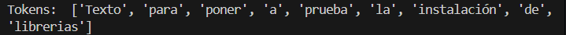
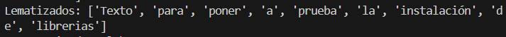
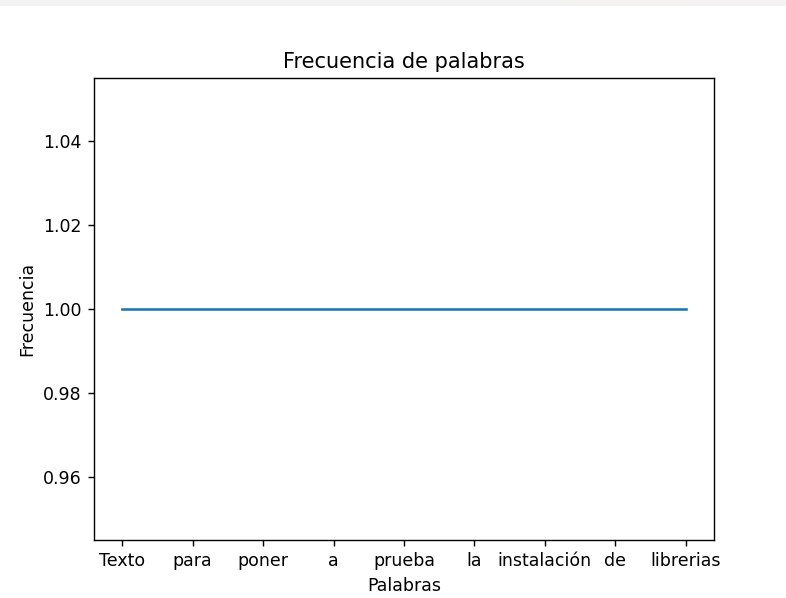

**Tokenización de texto**

 **Lematización de palabras**

 **Frecuencia de palabras**
 
 **Visualización de datos**
 

 Conceptos clave:

### **Procesamiento de Textos**
- **Tokenización**: Dividir un texto en unidades más pequeñas, como palabras o frases.
- **Lematización**: Reducir las palabras a su forma base o raíz.
- **Análisis de Sentimientos**: Determinar si el tono de un texto es positivo, negativo o neutral.

### **Métodos Avanzados en NLP**
- **Modelos de Lenguaje**: Algoritmos que entienden y generan texto en función del contexto (e.g., GPT, BERT).
- **Aprendizaje Profundo en NLP**: Uso de redes neuronales profundas para mejorar la comprensión y generación del lenguaje.
- **Traducción Automática**: Convertir texto de un idioma a otro utilizando algoritmos de NLP.

### **Desafíos y Consideraciones Éticas**
- **Privacidad de Datos**: Protección de la información personal en los datos textuales procesados.
- **Sesgos en el Análisis de Textos**: Prejuicios en los modelos de NLP que pueden reflejar o amplificar sesgos humanos.

### **Aplicaciones Prácticas de NLP**
- **Motores de Búsqueda**: Herramientas que indexan y recuperan información relevante basada en consultas textuales.
- **Asistentes Virtuales**: Sistemas que interactúan con usuarios mediante lenguaje natural (e.g., Siri, Alexa).
- **Sistemas de Recomendación**: Algoritmos que sugieren productos o contenido basado en preferencias y comportamientos del usuario.
